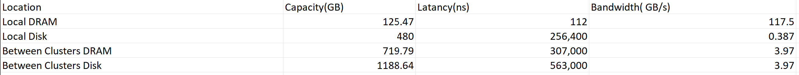

# Homework Assignment 1

### You can find my chart below or in the file "hierarchy/HW1 chart.png"
#### You can find some of the measurements in txt files in this git

What you can see in the graph is the measurements I took by running the commands given for the assignments.
I measured the capacity, bandwidth and latancy of the local DRAM, local Disk, between two clusters for the DRAM(node0 and node1) and between two clusters for the Disk.

### Clarifications for between two clustres measurements
- DRAM Capacity of two clusters is the local DRAM and disk of node0 and the DRAM of node1
- Disk Capacity of the two clusters is DRAM and Disk together for both.
- Latancy between two clusters is the network ping latancy plus the latancy to reach the local DRAM
- Bandwidth between two clusters is the bottleneck of bandwidth wich is the bandwidth to transfer data between the two nodes

### Observations:
- Local DRAM's bandwidth is the highest with a huge difference, than the bandwidth to the local disk(lowest) and to another node.
- There is a big difference between the latancy of local DRAM and local Disk comparared to local disk and to another node's DRAM
  

